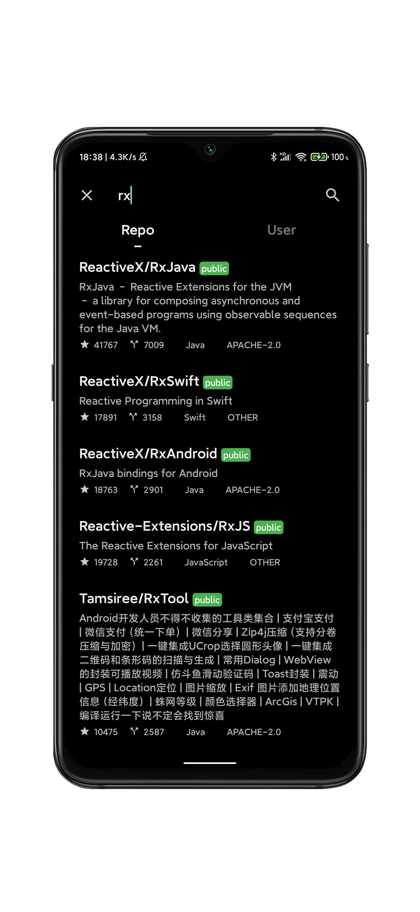

# MyHub

MyHub is an Android client of github.

## Source Code

* [Github Android](https://github.com/wuzehua/githubAndroid)

## Features

* Access Token
* Search and browse Repos
* Search and browse Users
* Download the assets of releases
* See your starred, public, private, fork Repos

## Screenshots

|  |  |
|:-:|:-:|
| Info | Repos |

|  |  |
|:-:|:-:|
| Commits | Search |

## Dependencies

* [Retrofit](https://github.com/square/retrofit) for HTTP request
* [Glide](https://github.com/bumptech/glide) for loading image
* [Gson](https://github.com/google/gson) for converting a JSON string to an equivalent Java object

## Releases

* [1.0.0 beta 1](https://github.com/wuzehua/MyHub/releases/tag/1.0.0.1)

## FAQ

    
 Where is the source code?

    
The repository is private. When it is ready, I will make it public.

## Something else...

If you like the app, give me a star.
